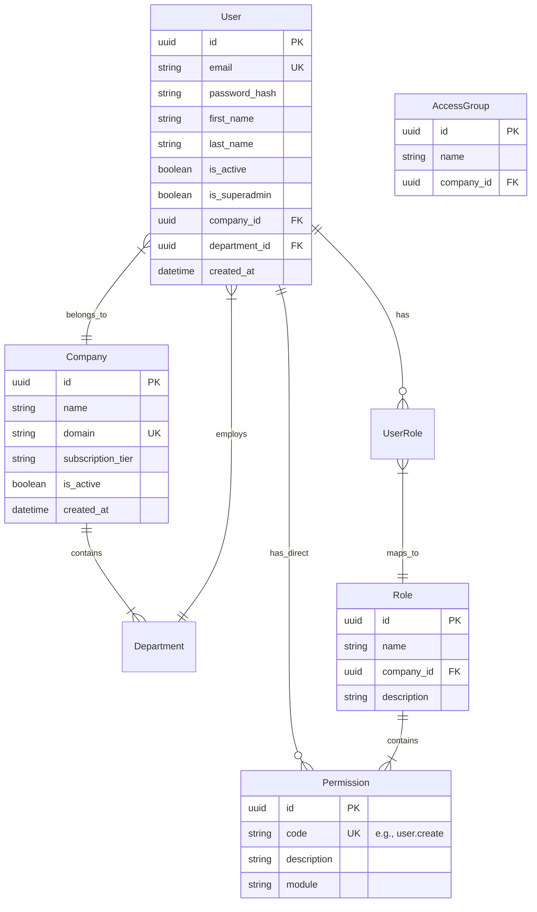
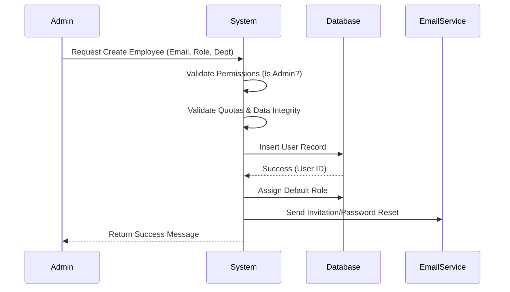
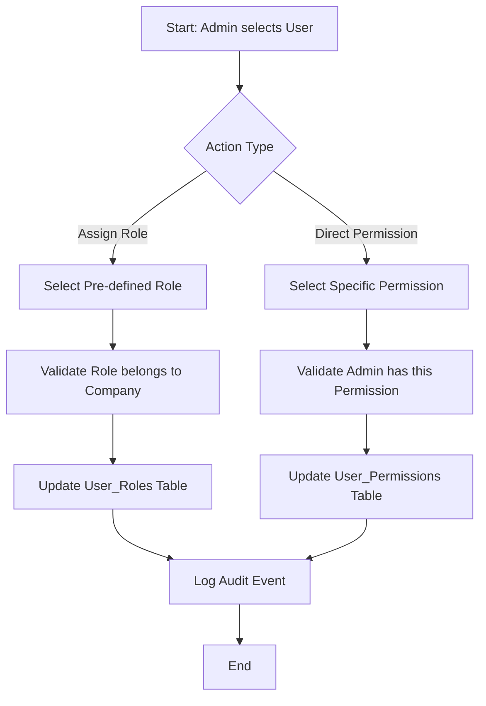

# Multi-Tier User Management System Specification

## 1. System Overview

This document outlines the architecture and specifications for a centralized platform designed to manage users, companies, and projects. The system is built on a multi-tenant architecture supporting multiple companies, each with its own administrative control, while a global Superadmin maintains system-wide oversight.

### Key Modules

- **User Management**: Centralized identity and access management.
- **HR Dashboard**: Employee hierarchy and department management.
- **User Dashboard**: Individual user portal.
- **Project Management**: Assignment and tracking capabilities.

### User Hierarchy

The system enforces a strict three-tier hierarchy:

1. **Superadmin**: Global system administrator.
2. **Admin**: Company-level administrator.
3. **Employee**: End-user with role-based access permissions.

---

## 2. User Roles and Permissions

### 2.1 Superadmin

**Scope**: Global (All Companies).

- **Capabilities**:
  - Create, suspend, or delete Company accounts.
  - Create and assign initial Admins to Companies.
  - Override any permission setting in the system.
  - View global system logs and audit trails.
  - Manage global system configurations.

### 2.2 Admin

 **Scope**: Local (Assigned Company only).

- **Capabilities**:
  - **User Management**: Create, modify, and deactivate Employee accounts within their company.
  - **Role Management**: Assign roles and specific permissions to Employees.
  - **Structure**: Define departments and teams.
  - **Constraint**: Cannot modify other Admins or Superadmin accounts. Cannot access data of other Companies.

### 2.3 Employee

 **Scope**: Restricted (Assigned Permissions).

- **Capabilities**:
  - Access features explicitly granted via roles or direct permissions.
  - View own profile and assigned dashboard.
  - Participate in assigned projects.
  - **Constraint**: No administrative capabilities unless explicitly granted specific delegation rights (rare).

---

## 3. Core Components Documentation

### 3.1 Database Schema (ERD)

The database uses a relational model to ensure data integrity and enforce constraints.

#### Entities & Relationships

#### Field Specifications

 **Users**:

- `email`: Indexed, Unique, validated format.
- `company_id`: Nullable only for Superadmins.
- **Companies**:
  - `domain`: Used for tenant resolution (optional).
- **Permissions**:
  - `code`: Standardized nomenclature (e.g., `module.action` -> `hr.view_salary`).

### 3.2 Data Flow Diagrams

#### User Creation Workflow (Admin -> Employee)

#### Permission Assignment Process

### 3.3 Migration Strategy

#### Phase 1: Initial Schema Setup

- Create tables in order: `Companies` -> `Permissions` -> `Roles` -> `Users`.

- Establish foreign key constraints with `ON DELETE RESTRICT` to prevent accidental data loss.

#### Phase 2: Seed Data

 **System Initialization**:

- Create default Permissions list (static reference data).
- Create initial Superadmin account.
- Create "System" company (optional, for superusers).

#### Phase 3: Versioning

- Use migration files (e.g., Alembic or Django Migrations) for schema changes.

- Data migrations must accompany schema changes for backward compatibility.

---

## 4. Functional Requirements

### 4.1 User Management Module

 **CRUD Operations**: Full lifecycle management for users.

- **Soft Delete**: Deactivation instead of hard deletion to preserve audit history.
- **Bulk Actions**: Import/Export users via CSV/Excel.
- **Password Policy**: Enforce complexity, expiration, and history.

### 4.2 Company Management

 **Profile**: Logo, address, fiscal settings.

- **Structure**: Dynamic tree structure for Departments/Teams.
- **Quotas**: Limits on user count based on subscription.

### 4.3 Access Control (RBAC + ABAC)

 **RBAC**: Role-Based Access Control for standard operations.

- **Granularity**: Permission checks at the API/View level.
- **Audit Logging**: Immutable logs for:
  - Login/Logout.
  - Permission changes.
  - Data export.
  - Sensitive record access.

---

## 5. Non-Functional Requirements

### 5.1 Security

 **Authentication**: JWT (JSON Web Tokens) or Session-based with MFA support.

- **Encryption**:
  - At rest: Database encryption for PII (Personally Identifiable Information).
  - In transit: TLS 1.3 enforcement.
- **Tenant Isolation**: Logical isolation via `company_id` filters in every query.

### 5.2 Performance

 **Benchmarks**:

- API Response time < 200ms for 95th percentile.
- Support 10,000 concurrent users per instance.
- **Optimization**:
  - Redis caching for Permissions and User Sessions.
  - Database indexing on frequently filtered columns (`company_id`, `email`, `role_id`).

### 5.3 Scalability

 **Horizontal**: Stateless API design to allow load balancing.

- **Database**: Read replicas for reporting modules.

### 5.4 Data Retention

 **Audit Logs**: Retained for 1 year (hot storage) -> archived to cold storage thereafter.

- **Deleted Accounts**: PII anonymized after 30 days of deactivation (GDPR compliance).

---

## 6. Implementation Guidelines

### 6.1 Recommended Architecture

#### **Modular Monolith or Microservices**

- Given the "Centralized" requirement, a Modular Monolith is recommended initially to reduce complexity, with distinct boundaries between `Auth`, `CompanyContext`, and `ProjectManagement` modules.

### 6.2 Technology Stack Considerations

 **Backend**: Python (Django)

- **Database**: PostgreSQL (preferred for complex relational queries and JSONB support).
- **Frontend**: React or Vue.js for dashboard interactivity.

### 6.3 Integration Points

 **SSO**: SAML/OIDC integration for Enterprise clients.

- **Notifications**: Email (SendGrid/AWS SES) and Push Notifications.

### 6.4 Testing Strategy

 **Unit Tests**: >80% coverage on Business Logic (Services).

- **Integration Tests**: Focus on Permission boundaries (e.g., "Can Company A Admin see Company B User?").
- **Security Tests**: Automated penetration testing for IDOR (Insecure Direct Object References) vulnerabilities.
